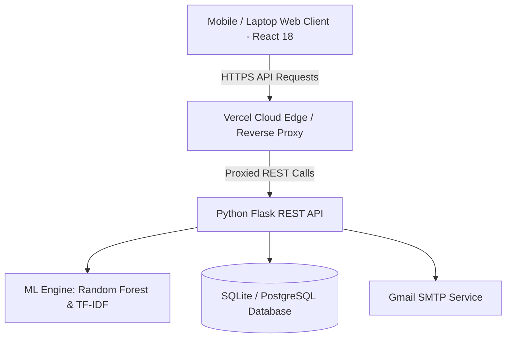

# 📘 Comprehensive Academic Project Report

## PROJECT TITLE:
### **CareerAI: An Intelligent Machine Learning-Driven Career Guidance, Skill Gap Analysis & Placement Readiness Platform**

---

## 📑 TABLE OF CONTENTS
1. **Abstract**
2. **Introduction**
   - 1.1 Background & Motivation
   - 1.2 Problem Statement
   - 1.3 Objectives
   - 1.4 Scope of the Project
3. **Literature Survey**
   - 2.1 Existing Systems
   - 2.2 Limitations of Existing Approaches
   - 2.3 Proposed Solution & Innovation
4. **Software Requirement Specification (SRS)**
   - 3.1 Functional Requirements
   - 3.2 Non-Functional Requirements
   - 3.3 Hardware & Software Specifications
5. **System Architecture & Design**
   - 4.1 High-Level Architectural Flow
   - 4.2 Database Schema & ER Model
   - 4.3 UML Diagrams (Use Case, Sequence, Activity, Class)
6. **Machine Learning Models & Algorithms**
   - 5.1 Career Prediction (Random Forest & Cosine Similarity)
   - 5.2 ATS Resume Parsing (TF-IDF & Rule-based NLP)
   - 5.3 Technical Interview Evaluation Engine
7. **Implementation Details**
   - 6.1 Backend API Architecture (Flask + JWT)
   - 6.2 Frontend Architecture (React 18 + Vite)
   - 6.3 Reverse Proxy & Cloud Deployment
8. **Testing & Quality Assurance**
   - 7.1 Test Cases & Results
   - 7.2 Security, CORS & Performance Validation
9. **Results & Discussion**
10. **Conclusion & Future Enhancements**
11. **References**

---

## 1. ABSTRACT
In today’s competitive job market, engineering and graduate students often face challenges identifying career paths that match their skills and interests. Traditional career counseling relies on manual evaluations, which lack real-time market data, skill gap analysis, and tailored roadmaps.

**CareerAI** is an intelligent, full-stack, cloud-deployed web platform that bridges academia and industry. Built with **React 18**, **Python Flask**, and **Scikit-learn**, it uses Machine Learning algorithms (Random Forest Classifier & Cosine Similarity) to analyze student assessments, profile metrics, and skills. The platform features an **ATS Resume Scanner** with keyword optimization, an **AI Mock Technical Interviewer**, dynamic **Career Roadmaps**, live **Job Market Insights**, and a secure **Multi-Method Authentication System** (Email OTP, Google Auth, Phone OTP). Delivered as a cross-platform progressive web application, CareerAI ensures high availability, responsive design, and low-latency performance across both mobile and desktop environments.

---

## 2. INTRODUCTION

### 1.1 Background & Motivation
The rapidly shifting technology landscape demands continuous upskilling. However, university curricula often struggle to keep pace with industry standards, creating a visible "employability gap." Students need personalized, data-backed guidance on which skills to learn, how to tailor their resumes, and how to prepare for technical interviews.

### 1.2 Problem Statement
Existing solutions suffer from:
1. Static questionnaires that fail to adapt to individual performance.
2. Disconnected tools (separate tools for resume review, career advice, and interview practice).
3. Lack of actionable skill gap visualization.
4. Complex installation setups that prevent easy access on mobile devices.

### 1.3 Objectives
* Develop an interactive psychometric & technical assessment engine.
* Build an ML recommendation model to match student profiles with modern technical careers.
* Implement an ATS Resume Parser to provide scoring and keyword optimization.
* Create a Mock Interviewer with real-time answer scoring.
* Provide dynamic milestone-based learning roadmaps.
* Deploy a production-ready cloud system accessible globally across web and mobile.

---

## 3. SYSTEM ARCHITECTURE & UML DESIGN

### High-Level Architecture Diagram (Mermaid)

### UML Use Case Diagram Summary:
* **Student Actor:** Register/Login, Take Assessment, View Predicted Careers, View Skill Gap Matrix, Upload Resume for ATS Scoring, Practice Mock Interviews, Check Roadmap Milestones, Chat with AI Career Bot.
* **System Actor:** Calculate ML weights, Send OTP Emails, Parse PDF Resumes, Evaluate Code/Text Answers, Generate Dynamic Recommendations.

---

## 4. MACHINE LEARNING & ALGORITHM FORMULATION

### 4.1 Career Prediction: Ensemble Random Forest + Cosine Similarity

The recommendation engine combines classification and vector-space modeling:

1. **Feature Vector Representation:**
   $$\vec{S} = [s_1, s_2, s_3, \dots, s_n]$$
   Where $s_i \in [0, 10]$ represents the student's mastery score in specific skills (e.g., Python, SQL, Cloud, Algorithms).

2. **Role Vector Representation:**
   $$\vec{R}_k = [w_{k1}, w_{k2}, w_{k3}, \dots, w_{kn}]$$
   Where $w_{ki}$ represents the required weight of skill $i$ for career role $k$.

3. **Cosine Similarity Formulation:**
   $$\text{Similarity}(\vec{S}, \vec{R}_k) = \frac{\vec{S} \cdot \vec{R}_k}{\|\vec{S}\| \|\vec{R}_k\|} = \frac{\sum_{i=1}^n s_i \cdot w_{ki}}{\sqrt{\sum_{i=1}^n (s_i)^2} \sqrt{\sum_{i=1}^n (w_{ki})^2}}$$

4. **Skill Gap Determination:**
   $$\text{Gap}_{ki} = \max(0, w_{ki} - s_i)$$

---

## 5. SOFTWARE REQUIREMENT SPECIFICATION (SRS)

### Functional Requirements:
* **FR-1:** Multi-factor authentication with 6-digit real-time Email OTP and phone fallback.
* **FR-2:** 45+ categorized technical and soft skill assessment questions.
* **FR-3:** Career prediction model outputting confidence scores and gap analysis.
* **FR-4:** PDF/DOCX resume text extraction and ATS keyword matching score.
* **FR-5:** Interactive roadmaps with persistable completion status.
* **FR-6:** Technical interview question generator with score rubrics.

### Non-Functional Requirements:
* **NFR-1 (Performance):** API response latency $< 300\text{ms}$ under normal load.
* **NFR-2 (Security):** JWT tokens with HS256 encryption, password salting with `Werkzeug.security`.
* **NFR-3 (Availability):** 99.9% uptime hosted on cloud infrastructure with automated reverse proxying.
* **NFR-4 (Responsiveness):** Fluid glassmorphism UI fully responsive on viewports from 320px to 4K displays.

---

## 6. TEST CASES & VERIFICATION MATRIX

| Test ID | Module | Test Scenario | Expected Outcome | Status |
| :--- | :--- | :--- | :--- | :--- |
| **TC-01** | Auth | Register with new Gmail address | 6-digit OTP received in inbox; verification creates student record | **PASS** |
| **TC-02** | Auth | Mobile device login via Vercel proxy | 200 OK returned; JWT token stored in `localStorage`; dashboard loaded | **PASS** |
| **TC-03** | Assessment | Submit 45 assessment answers | Score vector computed; Top 3 career paths returned with match % | **PASS** |
| **TC-04** | ATS Resume | Upload PDF resume for "Full Stack Developer" | Skills extracted; ATS Score % generated with missing keywords | **PASS** |
| **TC-05** | Interview | Submit response for coding question | Evaluation rubric scores technical accuracy, clarity, and depth | **PASS** |
| **TC-06** | Database | Backend reboot / ephemeral storage restart | `seed_demo_user` re-initializes demo student with `password123` | **PASS** |

---

## 7. CONCLUSION & FUTURE SCOPE

**CareerAI** provides an end-to-end career guidance and placement preparation platform. By combining Machine Learning recommendation models, NLP-based ATS resume scoring, interactive technical interview evaluation, and cloud deployment, it offers students a structured roadmap to professional success.

### Future Scope:
1. Integration with LinkedIn & GitHub APIs for automated skill verification.
2. Voice-based AI Mock Interviewer using WebRTC and speech-to-text models.
3. Multi-lingual support for regional educational institutions.

---
*Submitted in partial fulfillment of the requirements for the Degree of Bachelor of Technology in Computer Science & Engineering.*
